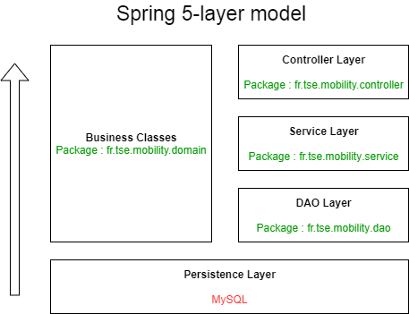
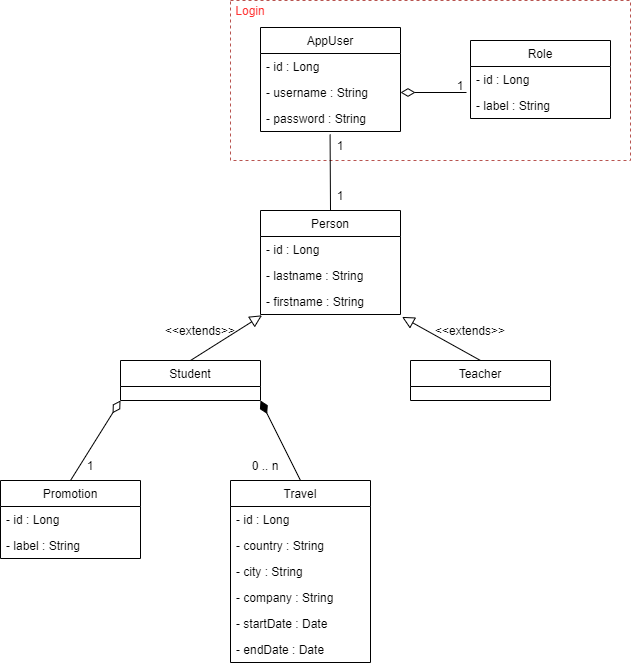

# Architecture-N-Tiers-Back

### Spring Architecture

### Domain Objects - Class diagram :

### Documentation API
Swagger : [Documentation](https://app.swaggerhub.com/apis-docs/Projet-Startup-Poc/Projet-Startup-POC/1.0.0#/)

## Minimum Requirements
* **JDK8:**
* **MySQL**

## Installation
- Clone repository : `git clone https://github.com/ValentinMoreau08/Architecture-N-Tiers-Back.git`
- Navigate into cloned folder : `cd Architecture-N-Tiers-Back`
- Use latest branch : `git checkout main`
- Import project into your IDE

    
## Configure MySQL access :
We use 2 Databases in this project : A first for production (default: **mobility**), A second for tests only (default: **mobility-test**).
   
- Configure access to these Databases in files ([Documentation](https://gist.github.com/memory-lovers/4132241df38456642ad888634caee5c6)):
  - `src/main/resources/application.properties`
  - `src/main/resources/application-test.properties`
- **Create MySQL databases :**
  - In MySQL, create 2 empty database with name defined previously. (Our application will create tables, but can't create Databases)

## Start
- Make sure your MySQL is started
- Run project with maven

## Test policy
Controller, Service and DAO layers are tested by JUnit5 in folder : `src/test/java/`
